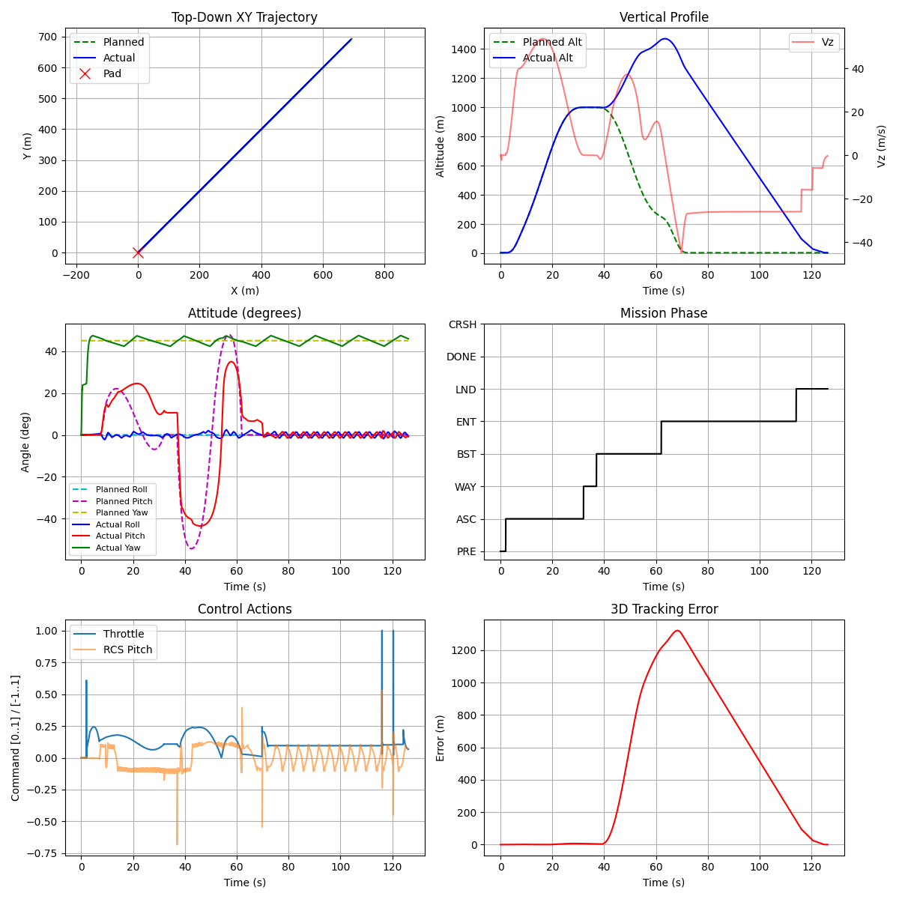

# RocketLander3D: Falcon 9 Flight Computer Simulator

A high-fidelity 3D Rocket Landing simulation built with [PyBullet](https://pybullet.org/). This project simulates a complete SpaceX Falcon 9 Return-To-Launch-Site (RTLS) mission using pure classic Control Theory (PID), 3D Trajectory Planning, and Autonomous State Machines.



## Core Features

- **Autonomous Flight Computer**: A deterministic, multi-layered control architecture that handles the rocket from liftoff to precision touchdown without Reinforcement Learning.
- **3D Trajectory Generation**: Uses Quintic Polynomials to plan smooth, time-parameterized flight paths (Position, Velocity, Acceleration) in 3D space.
- **Dynamic State Machine**: Executes strict mission phases:
  - `ASCENT`: Gravity turn and altitude gain.
  - `WAYPOINT_NAV`: Coasting to specific coordinates.
  - `BOOSTBACK`: Rapid horizontal acceleration to return to the pad.
  - `ENTRY_BURN`: Aerodynamic braking and dynamic descent profiling (up to 80m/s drop).
  - `LANDING_BURN`: Final precision hover and soft touchdown at [0,0,0].
- **Thrust Vectoring & Control Systems**:
  - `AltitudeController`: Cascaded PID managing main engine throttle with dynamic descent limits.
  - `HorizontalController`: Computes required pitch/roll attitudes and ensures horizontal thrust priority.
  - `AttitudeController`: Precision PID for Reaction Control System (RCS) gas thrusters.
- **Telemetry System**: Generates real-time HUDs and comprehensive post-flight data reports (`matplotlib`).

## Installation

```bash
git clone https://github.com/fitranurmayadi/RocketLander3D.git
cd RocketLander3D
pip install -e .
```

## Running the Falcon 9 Simulation

Watch the flight computer execute the complete RTLS mission in 3D:

```bash
python -m rocketlander.run_falcon9
```

**Options:**
- `--no-render`: Run headless (much faster) to just generate the telemetry report.
- `--max-steps`: Set maximum physics steps (default is 25000).

## Project Structure

- `rocketlander/`: The core Flight Computer (Controllers, Trajectory Planner, State Machine, Telemetry).
- `rocket_lander/`: The PyBullet Physics Environment (`rocket_lander_env.py`) and URDF assets.
- `scripts/`: Various utility scripts, calibration tools, and old RL experiments.
- `tests/`: Module tests.
- `images/`: Telemetry reports and output plots.

## Authors
- **Fitra Nurmayadi** - *Flight Architecture & Physics Simulation*
