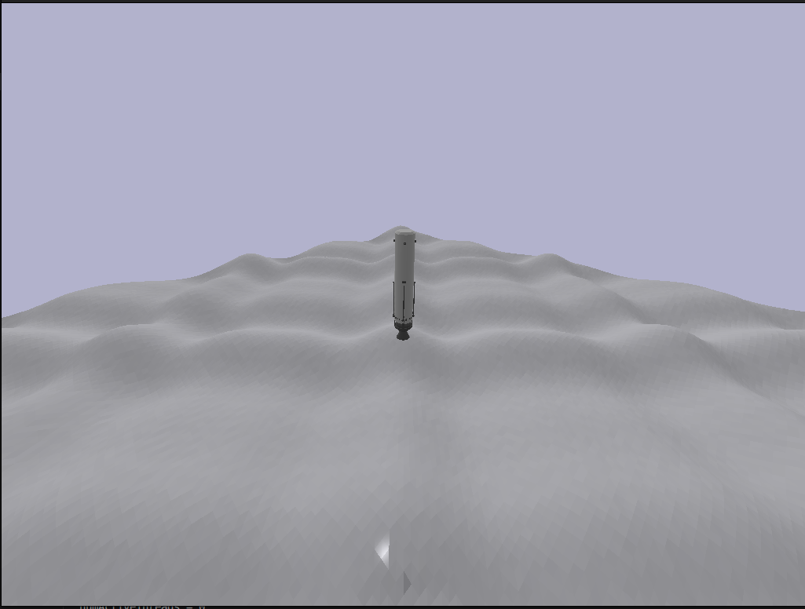
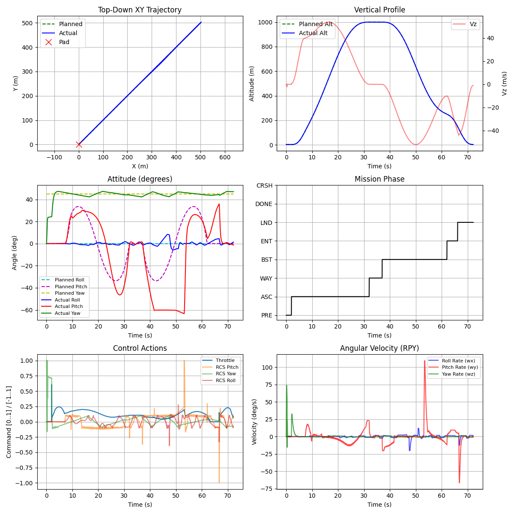
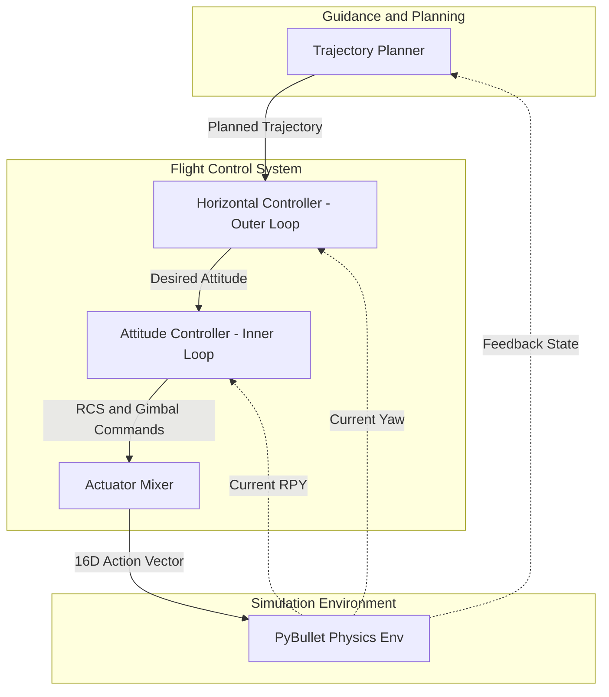

# RocketLander3D

A high-fidelity 3D Rocket Landing environment and flight control simulation built with [Gymnasium](https://gymnasium.farama.org/) and [PyBullet](https://pybullet.org/).

## Simulation Previews

### 3D Simulation GUI Preview


### Flight Control Performance Report Preview


---

## 1. Environment & System Specifications

RocketLander3D simulates a slender SpaceX Falcon 9-style booster during its vertical landing (VTVL) phases. The simulation incorporates realistic physical characteristics, variable mass dynamics, and constraints.

### 1.1 Physical & Mass Specifications
* **Vehicle Geometry**: Slender "pencil" cylinder, height $\approx 5.0$ m.
* **Wet Mass ($M_{\text{wet}}$)**: $3,000$ kg (full fuel tank).
* **Dry Mass ($M_{\text{dry}}$)**: $300$ kg (empty fuel tank).
* **Variable Mass**: Fuel consumption reduces the overall vehicle mass and moment of inertia in real-time according to:

$$ M(t) = M_{\text{dry}} + f(t) \cdot (M_{\text{wet}} - M_{\text{dry}}) $$

  where $f(t) \in [0, 1]$ is the normalized fuel level.
* **Thrust-to-Weight Ratio (TWR)**:
  * **Full Tank**: $\text{TWR} \approx 2.0$ (Heavy, slow response, high inertia).
  * **Empty Tank**: $\text{TWR} \approx 20.0$ (Extremely agile, hyper-sensitive throttle).

### 1.2 Actuators (Action Space)
The action vector is a continuous space $u \in [-1, 1]^{16}$ containing 16 dimensions:

| Index | Component | Mathematical Mapping | Physical Behavior & Range |
| :--- | :--- | :--- | :--- |
| **0** | **Main Engine Throttle** | $T = \frac{u_0 + 1}{2}$ | $0\%$ to $100\%$ ($60,000$ N Max thrust). |
| **1** | **Gimbal Pitch ($\delta_p$)** | $\delta_p = u_1 \cdot 0.35$ | Pitch deflection range: $[-0.35, 0.35]$ rad. |
| **2** | **Gimbal Roll ($\delta_r$)** | $\delta_r = u_2 \cdot 0.35$ | Roll deflection range: $[-0.35, 0.35]$ rad. |
| **3-14** | **RCS Thrusters** | $R_i = \frac{u_i + 1}{2}$ | 12 discrete cold-gas thrusters ($0\%$ to $100\%$). |
| **15** | **Landing Legs** | Linear LERP | Deploy threshold ($>0$ deploys legs from $1.507$ to $-1.2$ rad). |

### 1.3 Sensors & Observations
The observation vector is a continuous space $s \in \mathbb{R}^{19}$:

| Index | Observation | Type | Coordinate Frame / Detail |
| :--- | :--- | :--- | :--- |
| **0-2** | **Position** | Vector3 | World Coordinates $(X, Y, Z)$ in meters. |
| **3-6** | **Orientation** | Quat | World Orientation Quaternion $(x, y, z, w)$. |
| **7-9** | **Linear Velocity** | Vector3 | World velocity $(\dot{X}, \dot{Y}, \dot{Z})$ in m/s. |
| **10-12** | **Angular Velocity** | Vector3 | Local body frame angular rates $(\omega_x, \omega_y, \omega_z)$ in rad/s. |
| **13-16** | **Leg Contacts** | 4x Float | Binary indicator ($1.0$ if leg $i$ touches ground, $0.0$ otherwise). |
| **17** | **Altitude** | Float | Altitude above ground (Global $Z$ coordinate). |
| **18** | **Fuel** | Scalar | Normalized fuel remaining ($1.0 \to 0.0$). |

---

## 2. Algorithms & Control System Architecture

The flight controller in `rocketlander` uses a **Cascaded Flight Control Architecture** combined with a **3D Quintic Polynomial Trajectory Planner**.



### 2.1 3D Quintic Polynomial Trajectory Planner
To generate a dynamically feasible and smooth trajectory between waypoints, a 1D quintic (5th-degree) polynomial is solved independently for the $X, Y,$ and $Z$ axes:

$$ p(t) = a_0 + a_1 t + a_2 t^2 + a_3 t^3 + a_4 t^4 + a_5 t^5 $$

$$ \dot{p}(t) = a_1 + 2 a_2 t + 3 a_3 t^2 + 4 a_4 t^3 + 5 a_5 t^4 $$

$$ \ddot{p}(t) = 2 a_2 + 6 a_3 t + 12 a_4 t^2 + 20 a_5 t^3 $$

Given boundary conditions at $t=0$ (initial position $p_0$, velocity $v_0$, acceleration $a_0$) and $t=T$ (target position $p_T$, velocity $v_T$, acceleration $a_T$):

1. $a_0 = p_0$
2. $a_1 = v_0$
3. $a_2 = \frac{a_0}{2}$

The remaining coefficients $a_3, a_4, a_5$ are computed by solving the following matrix equation:

$$ \begin{bmatrix} T^3 & T^4 & T^5 \\ 3T^2 & 4T^3 & 5T^4 \\ 6T & 12T^2 & 20T^3 \end{bmatrix} \begin{bmatrix} a_3 \\ a_4 \\ a_5 \end{bmatrix} = \begin{bmatrix} p_T - a_0 - a_1 T - a_2 T^2 \\ v_T - a_1 - 2 a_2 T \\ a_T - 2 a_2 \end{bmatrix} $$

### 2.2 Cascaded Translation Controller
The outer loop tracks horizontal positioning by computing the required lateral acceleration vector in the world frame:

$$ \begin{aligned} a_{x,\text{world}} &= a_{d,x} + K_{p,\text{horiz}} e_x + K_{d,\text{horiz}} \dot{e}_x \\ a_{y,\text{world}} &= a_{d,y} + K_{p,\text{horiz}} e_y + K_{d,\text{horiz}} \dot{e}_y \end{aligned} $$

where $e$ is the position error ($x_{\text{ref}} - x_{\text{actual}}$) and $\dot{e}$ is the velocity error.

To map these accelerations to the rocket body's frame, we rotate them using the current yaw angle $\psi$:

$$ \begin{aligned} b_x &= a_{x,\text{world}} \cos(\psi) + a_{y,\text{world}} \sin(\psi) \\ b_y &= -a_{x,\text{world}} \sin(\psi) + a_{y,\text{world}} \cos(\psi) \end{aligned} $$

Using the rocket's thrust force vectors, the desired Euler tilt angles (Pitch $\theta_{\text{des}}$ and Roll $\phi_{\text{des}}$) are derived as:

$$ \begin{aligned} \theta_{\text{des}} &= \text{atan2}(b_x, g) \\ \phi_{\text{des}} &= \text{atan2}(-b_y, g) \end{aligned} $$

These values are clamped to safe angles ($[-1.0, 1.0]$ rad) to prevent aerodynamic instability and tumbling.

### 2.3 Attitude Controller (Inner Loop)
The inner loop resolves attitude commands by executing separate PID controllers tracking the error between planned angles and actual Euler angles:

$$ \begin{aligned} u_{\text{roll}} &= K_{p,\text{att}} e_{\phi} + K_{i,\text{att}} \int e_{\phi} \, dt + K_{d,\text{att}} \frac{de_{\phi}}{dt} \\ u_{\text{pitch}} &= K_{p,\text{att}} e_{\theta} + K_{i,\text{att}} \int e_{\theta} \, dt + K_{d,\text{att}} \frac{de_{\theta}}{dt} \\ u_{\text{yaw}} &= K_{p,\text{att}} e_{\psi} + K_{i,\text{att}} \int e_{\psi} \, dt + K_{d,\text{att}} \frac{de_{\psi}}{dt} \end{aligned} $$

* **Anti-Windup**: Integrals are clamped to prevent command saturation due to high vehicle inertia:

$$ \text{Limit}_{\text{integral}} = \frac{\text{Limit}_{\text{output}}}{K_i} $$

### 2.4 Altitude & Vertical Rate Controller
Altitude tracking is split into two modes:
1. **Cascade Mode (Ascent/Hover)**:

$$ v_{z,\text{des}} = \text{PID}_{\text{alt}}(e_z) $$

The desired vertical velocity delta is clamped dynamically based on altitude (e.g., max descent rate is $5$ m/s when near the ground, up to $80$ m/s at high altitudes) to ensure a soft touchdown.

$$ u_{\text{throttle}} = g_{\text{ff}} + 0.05 \cdot a_{z,\text{ff}} + \text{PID}_{vz}(v_{z,\text{err}} + v_{z,\text{des}}) $$

2. **Direct Velocity Mode (Landing Burn)**:

$$ u_{\text{throttle}} = g_{\text{ff}} + 0.05 \cdot a_{z,\text{ff}} + \text{PID}_{vz}(v_{z,\text{err}}) $$

### 2.5 Actuator Mixer
High-level control outputs $(T, \delta_p, \delta_r, u_{\text{roll}}, u_{\text{pitch}}, u_{\text{yaw}})$ are mapped directly to the 16D PyBullet actuator inputs:
* **Gimbal Alignment**:
  * $\text{Action}_1 = -\delta_p$
  * $\text{Action}_2 = -\delta_r$
* **RCS Allocation**: The 12 RCS thrusters are grouped to produce directional torques:
  * **Pitch Torque**: $+u_{\text{pitch}} \to \text{Thrusters } [1, 4]$; $-u_{\text{pitch}} \to \text{Thrusters } [0, 5]$
  * **Roll Torque**: $+u_{\text{roll}} \to \text{Thrusters } [2, 7]$; $-u_{\text{roll}} \to \text{Thrusters } [3, 6]$
  * **Yaw Torque**: $+u_{\text{yaw}} \to \text{Thrusters } [8, 9]$; $-u_{\text{yaw}} \to \text{Thrusters } [10, 11]$

---

## 3. Installation

```bash
git clone https://github.com/fitranurmayadi/RocketLander3D.git
cd RocketLander3D
pip install -e .
```

## 4. Quick Start

### Run Mission Simulator (Flight Controller)
To execute the multi-phase trajectory simulation:
```bash
python rocketlander/run_rocketlander3d.py
```
To run in headless mode (faster, no PyBullet GUI):
```bash
python rocketlander/run_rocketlander3d.py --no-render
```
The resulting performance graph will be generated and saved at `images/ultimate_mission_report_rocketlander3d.png`.

---

## Authors
* **Fitra Nurmayadi** - *Initial Work & Architecture*
