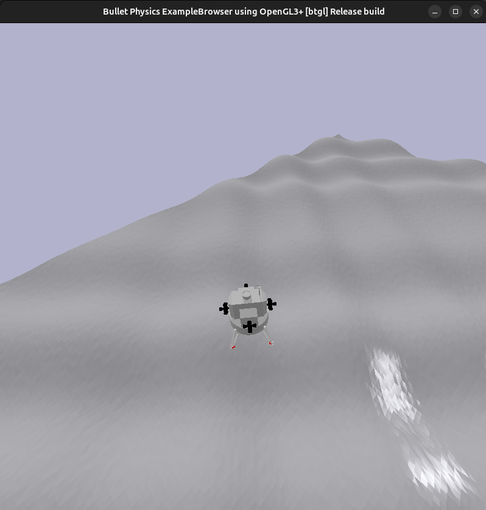

# LunarLander3D



LunarLander3D is a high-fidelity 6-Degree-of-Freedom (6-DoF) lunar landing simulation environment built with Gymnasium and PyBullet.

The project was originally started as an attempt to compare Reinforcement Learning and conventional control methods on an autonomous landing task. While existing LunarLander benchmarks provide a useful starting point, most operate in a simplified 2D setting and do not capture many of the challenges encountered in real flight-control systems.

To address this limitation, LunarLander3D extends the classic Lunar Lander concept into a fully 3D environment featuring rigid-body dynamics, realistic actuator models, procedural terrain generation, and multiple autonomous landing controllers.

The current focus of the project is Guidance, Navigation, and Control (GNC) research. Three controller architectures are included, ranging from classical PID control to trajectory-tracking methods. The environment is also designed to serve as a future testbed for Reinforcement Learning algorithms operating under realistic physical constraints.

---

# Project Motivation

This project began with a simple question:

> How does Reinforcement Learning compare against conventional flight-control methods on an autonomous landing problem?

Initially, the goal was to use the standard LunarLander environment provided by Gymnasium. However, its 2D nature limits the complexity of the control problem and does not fully represent the challenges involved in spacecraft guidance and landing.

Rather than modifying the existing benchmark, a new environment was developed from scratch with the following objectives:

- Simulate a realistic 3D landing scenario.
- Model full rigid-body dynamics.
- Support multiple control architectures.
- Provide a common platform for comparing control strategies.
- Serve as a future benchmark for Reinforcement Learning research.

The result is a flexible simulation platform that can be used to study:

- Autonomous landing
- Flight control
- Guidance systems
- Trajectory generation
- Robotics
- Reinforcement Learning

---

# 🚀 Features

## Physics & Simulation

- Full 6-DoF rigid-body dynamics.
- High-frequency PyBullet simulation (100 Hz).
- Multiple planetary environments:
  - Moon (default)
  - Earth
  - Mars
- Procedurally generated terrain with dedicated landing zones.
- Continuous observation and action spaces.

## Vehicle Model

- Apollo-inspired lunar lander configuration.
- Main engine for primary thrust generation.
- 20 RCS thrusters for attitude and lateral control.
- Realistic force and torque application through PyBullet.

## Guidance & Control

Three autonomous landing controllers are currently implemented:

- V1 — Decoupled PID Control
- V2 — Direct Thrust Vectoring
- V3 — Reference Trajectory Tracking

These controllers provide baseline performance references and demonstrate different approaches to solving the landing problem.

## Monitoring & Analysis

- Real-time telemetry dashboard.
- OSC-based telemetry streaming.
- Automatic mission performance reports.
- Episode visualization and performance analysis.

## Research Platform

- Gymnasium-compatible API.
- Continuous control environment.
- Suitable for:
  - Guidance, Navigation & Control (GNC)
  - Robotics research
  - Autonomous systems
  - Reinforcement Learning
  - Optimal control research

---

# 📁 Project Structure

```text
LunarLander3D/
├── README.md
├── requirements.txt
├── .gitignore
├── launch_mission.sh
├── live_dashboard.py
├── osc_sender.py
├── trajectory_planner.py
├── mission_v1_classic.py
├── mission_v2_direct.py
├── mission_v3_trajectory.py
├── lunar_lander_3d/
│   ├── __init__.py
│   └── envs/
│       ├── __init__.py
│       ├── lunar_lander_env.py
│       └── assets/
│           ├── lunar_lander.urdf
│           └── meshes/
└── reports/
```

---

# 🛠️ Installation

Clone the repository and install the required dependencies.

```bash
git clone https://github.com/fitranurmayadi/LunarLander3d.git
cd LunarLander3d
pip install -r requirements.txt
```

Recommended:

```bash
python -m venv venv
source venv/bin/activate
pip install -r requirements.txt
```

---

# 🎮 Running Missions

## Direct Execution

```bash
python mission_v1_classic.py
python mission_v2_direct.py
python mission_v3_trajectory.py
```

## Using the Mission Launcher

```bash
./launch_mission.sh v1
./launch_mission.sh v2
./launch_mission.sh v3
```

Without dashboard:

```bash
./launch_mission.sh v1 --no-dashboard
./launch_mission.sh v2 --no-dashboard
./launch_mission.sh v3 --no-dashboard
```

---

# 📋 Command-Line Arguments

All mission scripts share the same interface.

| Argument | Description |
|----------|-------------|
| `--episodes N` | Run multiple episodes |
| `--fixed` | Run compass-test scenarios |
| `--spawn X Y Z` | Specify spawn position |
| `--orient R P Y` | Specify initial orientation |
| `--no-render` | Disable PyBullet GUI |
| `--no-dashboard` | Disable telemetry dashboard |

Examples:

```bash
python mission_v1_classic.py --episodes 5

python mission_v2_direct.py \
    --spawn 500 -500 800

python mission_v3_trajectory.py \
    --spawn -1000 -1000 1000 \
    --orient 45 45 45
```

---

# 📊 Live Telemetry Dashboard

The telemetry dashboard provides real-time monitoring of mission performance.

| Panel | Metrics |
|---------|---------|
| Altitude & Vertical Speed | Height, Vz |
| Attitude | Roll, Pitch, Yaw |
| Horizontal Velocity | Vx, Vy |
| Safety Metrics | G-Force, Distance to Target |
| Control Actions | Main Thrust, RCS Activity |
| Mission Performance | Reward, State Information |

Launch dashboard independently:

```bash
python live_dashboard.py
```

Without OSC connection:

```bash
python live_dashboard.py --no-osc
```

Mission reports are automatically generated and saved inside:

```text
reports/
```

---

# 🧠 Controller Architectures

## V1 — Decoupled PID Control

### Overview

V1 implements a classical control architecture based on a Finite State Machine (FSM) and multiple decoupled PID controllers.

The controller separates horizontal guidance from vertical descent. Horizontal position errors are converted into desired velocities, which are then translated into target pitch and roll angles. Vertical motion is regulated independently through altitude and velocity control loops.

### Advantages

- Stable behavior across a wide range of initial conditions.
- Straightforward tuning process.
- Predictable control response.

### Limitations

- Conservative flight profile.
- Longer mission duration.
- Sequential behavior can produce inefficient trajectories.

V1 serves as the baseline controller for the project.


---

## V2 — Direct Thrust Vectoring

### Overview

V2 removes the strict separation between transit and landing phases used in V1.

Instead of following a sequence of discrete control states, the controller continuously redirects the vehicle's thrust vector toward the desired direction of travel while simultaneously reducing position and velocity errors.

Translation and attitude control become tightly coupled.

### Advantages

- Faster convergence toward the landing target.
- Smoother trajectories.
- Reduced transit time.

### Limitations

- More difficult tuning process.
- Increased sensitivity to disturbances.
- Strong coupling between translational and rotational dynamics.


---

## V3 — Reference Trajectory Tracking

### Overview

V3 represents the most advanced controller currently implemented.

Rather than reacting directly to position errors, the controller first generates a smooth reference trajectory connecting the initial state and the landing target.

At every simulation step, the controller computes:

- Reference position
- Reference velocity
- Reference acceleration

The vehicle then tracks these references using rigid-body dynamics and feed-forward control terms.

This transforms the landing problem into a trajectory-following problem rather than a pure error-correction problem.

### Advantages

- High landing precision.
- Smooth control inputs.
- Physically consistent motion profiles.
- Better handling of complex flight paths.

### Limitations

- Higher computational cost.
- Greater sensitivity to timing errors.
- More complex implementation.

V3 currently provides the best overall landing performance among the available controllers.


---

# 🛰️ Vehicle Model

The simulated vehicle is inspired by the Apollo Lunar Module but simplified to prioritize simulation stability, controllability, and experimentation.

The model preserves the characteristics most relevant to guidance and control research while avoiding unnecessary geometric complexity that would increase simulation cost without improving control fidelity.

The vehicle is represented as a rigid-body system equipped with a main engine and multiple Reaction Control System (RCS) thrusters capable of generating both translational and rotational motion.

## Physical Characteristics

### Dimensions

- Approximate diameter: 4 m
- Approximate height: 4 m
- Apollo-inspired geometry
- 4× mesh scale configuration

### Mass Distribution

| Component | Mass |
|------------|---------:|
| Main Body | 3500 kg |
| Main Engine | 500 kg |
| RCS Clusters | 400 kg |
| Landing Legs | 600 kg |
| Foot Sensors | 0.04 kg |
| Total | ~5100 kg |

### Main Engine

- Maximum thrust: 22,000 N
- Body-frame direction: +Z
- Single primary propulsion unit

### Reaction Control System (RCS)

- 20 individual thrusters
- Maximum thrust per nozzle: 5,000 N
- Provides:
  - Roll control
  - Pitch control
  - Yaw control
  - Lateral translation

---

# 🌍 Environment Model

The environment simulates planetary landing scenarios under realistic physical constraints.

Each episode begins with configurable position, altitude, and orientation offsets relative to the landing target.

The objective is to safely land inside the designated landing zone while maintaining acceptable velocity and attitude limits.

## Planetary Modes

| Planet | Gravity |
|----------|----------:|
| Moon | -1.62 m/s² |
| Earth | -9.80 m/s² |
| Mars | -3.711 m/s² |

## Terrain

Procedural heightfield terrain:

- Resolution: 256 × 256
- Area: approximately 1.28 km × 1.28 km
- Dedicated landing zone
- Configurable roughness

## Physics Configuration

- Engine: PyBullet
- Simulation frequency: 100 Hz
- Vacuum dynamics
- Zero damping configuration

---

# 📐 Environment Specifications

| Property | Value |
|-----------|---------|
| Observation Space | 34-dimensional continuous |
| Action Space | 21-dimensional continuous |
| Main Engine | 22,000 N |
| RCS Thrusters | 20 × 5,000 N |
| Planetary Modes | Moon, Earth, Mars |
| Terrain | Procedural Heightfield |
| Physics Engine | PyBullet |
| Simulation Rate | 100 Hz |

---

# 🔬 Future Work

Planned future developments include:

- PPO baseline
- SAC baseline
- TD3 baseline
- Model Predictive Control (MPC)
- Fuel consumption modelling
- Sensor noise simulation
- State estimation pipelines
- Disturbance rejection experiments
- Domain randomization
- Sim-to-real research workflows

The long-term objective is to establish LunarLander3D as a flexible research platform for autonomous landing and spacecraft control.

---

# 📄 License

This project is intended for educational, research, and experimental purposes.
